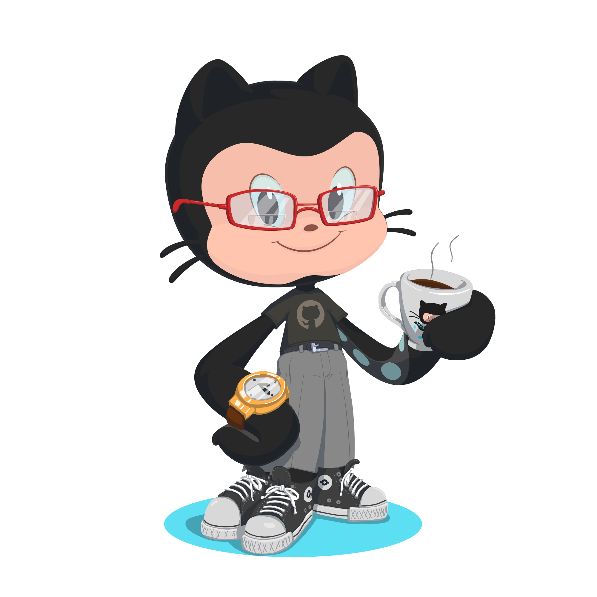

# 💫 About Me:
🌱 I’m currently learning JavaScript  📫 How to reach me jaybenrosales12@gmail.com

# 🌐 Socials:

# 💻 Tech Stack:
               

 # GitHub Stats:

 
 

## 🏆 GitHub Trophies

### ✍️ Random Dev Quote

---

