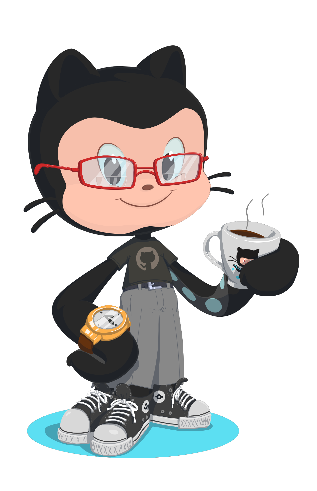

# 💫 About Me:
🌱 I’m currently learning JavaScript & diving deeper into full-stack dev   
🔥 Also building cool stuff with Flutter, Firebase, and Python frameworks   
📫 Reach me: **jaybenrosales12@gmail.com**

---

# 🌐 Socials:

  
  
  

---

# 💻 Tech Stack:

  
<!-- Web Tech -->
  
  
  

<!-- Backend & Frameworks -->
  
  
  
  
  
  
  

<!-- Frontend Frameworks -->
  
  
  
  

<!-- Mobile -->
  
  

<!-- Database & Cloud -->
  
  
  

<!-- Others -->
  
  

---

# 📊 GitHub Stats:

  
  

---

## 🏆 GitHub Trophies

---

### ✍️ Random Dev Quote

---

